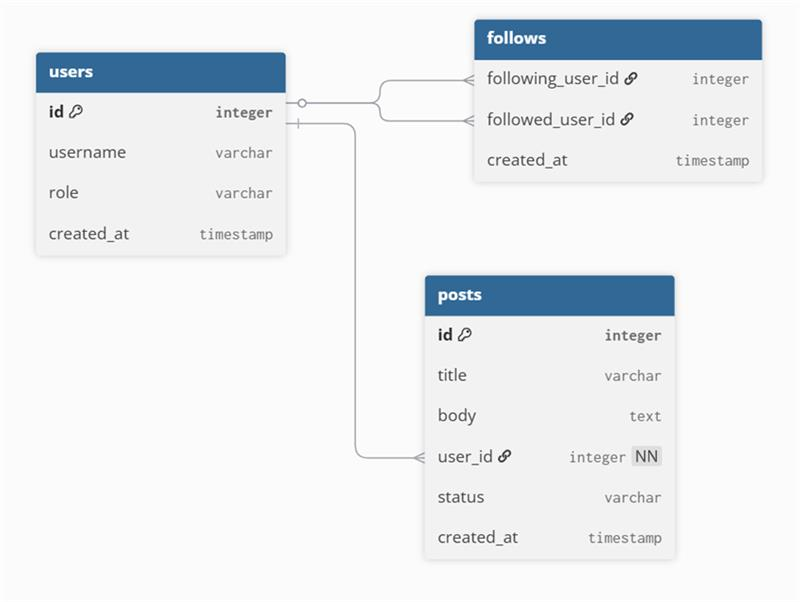

# Modelado y SQL en una Red Social

Un equipo de desarrollo está construyendo una red social básica centrada en publicaciones de texto y conexiones entre usuarios (siguiendo y seguidos). Se te ha contratado como parte del equipo de base de datos para construir y probar las consultas necesarias que alimentarán tanto la administración como el análisis del comportamiento de los usuarios.

Tu primera tarea es **crear localmente** una base de datos a partir de un modelo relacional predefinido. Posteriormente, deberás responder una serie de solicitudes utilizando **consultas SQL** que permitan manipular o consultar los datos (DML y DQL).

Además, se sugiere una versión avanzada que te permite probar lo mismo conectándote a una base de datos remota gratuita con **Aiven PostgreSQL**, para familiarizarte con el uso de servicios en la nube.

---

## Modelo relacional



**Instrucciones:**

1. Reproduce este modelo en tu motor local (MySQL o PostgreSQL).
2. Crea las tablas con las claves primarias y foráneas correspondientes.
3. Usa datos de ejemplo si lo necesitas para validar consultas.
4. No edites el modelo; enfócate en consultar y manipular la información según los requerimientos.

---

## Casos de uso y solicitudes

Para cada una de las siguientes situaciones, redacta la consulta SQL que te permitiría obtener la información o modificar los datos requeridos.
Debes interpretar lo que se necesita a partir del modelo de base de datos.

A cada consulta le acompaña un ejemplo de salida esperada (**output** simulado).

---

### 1. Listar todos los usuarios registrados.

**Ejemplo de salida:**

```
id | username    | role     | created_at
---------------------------------------------
1  | juan123     | user     | 2024-01-05 10:22
2  | cami_dev    | admin    | 2024-02-11 14:10
```

---

### 2. Ver todos los posts publicados por el usuario con username = 'sofia\_g'.

**Ejemplo de salida:**

```
title                 | status     | created_at
----------------------------------------------------------
Mi primer post        | publicado  | 2024-03-10 09:00
Tips para programar   | publicado  | 2024-03-15 11:30
```

---

### 3. Mostrar todos los usuarios con rol 'admin'.

**Ejemplo de salida:**

```
username   | created_at
-----------------------------
cami_dev   | 2024-02-11 14:10
admin_juli | 2024-04-03 08:40
```

---

### 4. Ver todos los posts con estado 'publicado'.

**Ejemplo de salida:**

```
id | title                | username
-------------------------------------------
1  | Hola Mundo           | juan123
2  | Guía de SQL          | cami_dev
```

---

### 5. Mostrar los nombres de los usuarios que están siendo seguidos.

**Ejemplo de salida:**

```
followed_username
---------------------
juan123
cami_dev
sofia_g
```

---

### 6. Consultar el número total de usuarios.

**Ejemplo de salida:**

```
total_usuarios
--------------
8
```

---

### 7. Mostrar los títulos de los posts creados hoy.

**Ejemplo de salida:**

```
title
-------------------------
Actualización del sistema
Post del día
```

---

### 8. Obtener el nombre del autor y título de cada post.

**Ejemplo de salida:**

```
username   | title
---------------------------
juan123    | Hola Mundo
sofia_g    | Ideas nuevas
```

---

### 9. Listar los usuarios junto con la cantidad de seguidores que tienen.

**Ejemplo de salida:**

```
username   | seguidores
----------------------------
juan123    | 3
sofia_g    | 1
```

---

### 10. Mostrar los usuarios que no han publicado ningún post.

**Ejemplo de salida:**

```
username
-------------
mario_89
ana_dev
```

---

### 11. Mostrar los posts junto con el número de palabras en el contenido (`body`).

**Ejemplo de salida:**

```
title          | palabras
-------------------------------
Hola Mundo     | 2
Mi historia    | 150
```

---

### 12. Consultar cuántos usuarios hay por tipo de rol.

**Ejemplo de salida:**

```
role    | cantidad
---------------------
user    | 6
admin   | 2
```

---

### 13. Obtener la fecha y el autor del post más reciente.

**Ejemplo de salida:**

```
username | title         | created_at
------------------------------------------
cami_dev | Última guía   | 2024-07-28 13:42
```

---

### 14. Mostrar los usuarios que siguen a más de 3 personas.

**Ejemplo de salida:**

```
username   | siguiendo_a
-------------------------------
luis_dev   | 5
sofia_g    | 4
```

---

### 15. Consultar los 5 posts más antiguos con estado 'borrador'.

**Ejemplo de salida:**

```
title           | created_at
-------------------------------
Post sin nombre | 2023-09-01
Idea pendiente  | 2023-10-05
```

---

### 16. Mostrar los usuarios con más de 2 posts publicados en estado 'publicado'.

**Ejemplo de salida:**

```
username   | publicados
--------------------------
juan123    | 3
sofia_g    | 4
```

---

### 17. Listar usuarios que no siguen a nadie pero sí tienen seguidores.

**Ejemplo de salida:**

```
username
-------------
admin_juli
mario_89
```

---

### 18. Mostrar usuarios que tienen posts pero nunca han seguido a nadie.

**Ejemplo de salida:**

```
username
-------------
ana_dev
joseph_r
```

---

### 19. Mostrar pares de usuarios que se siguen mutuamente.

**Ejemplo de salida:**

```
usuario_1   | usuario_2
-----------------------------
juan123     | sofia_g
sofia_g     | juan123
```

---

### 20. Eliminar todos los posts en estado 'borrador' de usuarios con rol 'guest'.

**Consulta esperada (acción destructiva):**
Eliminación de X registros si se ejecuta correctamente.

---
